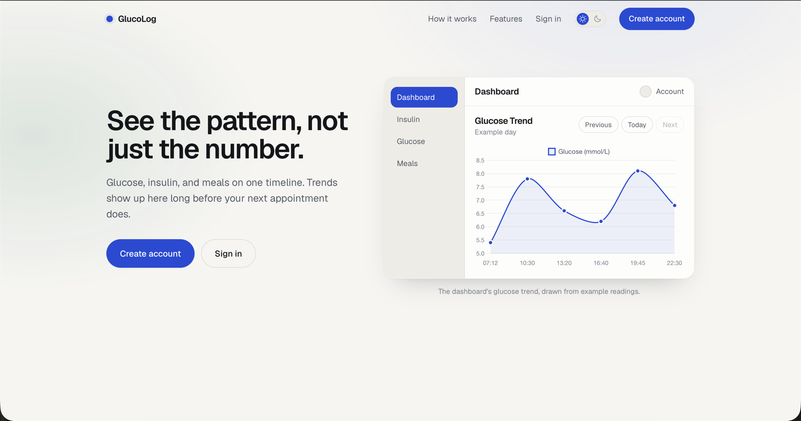
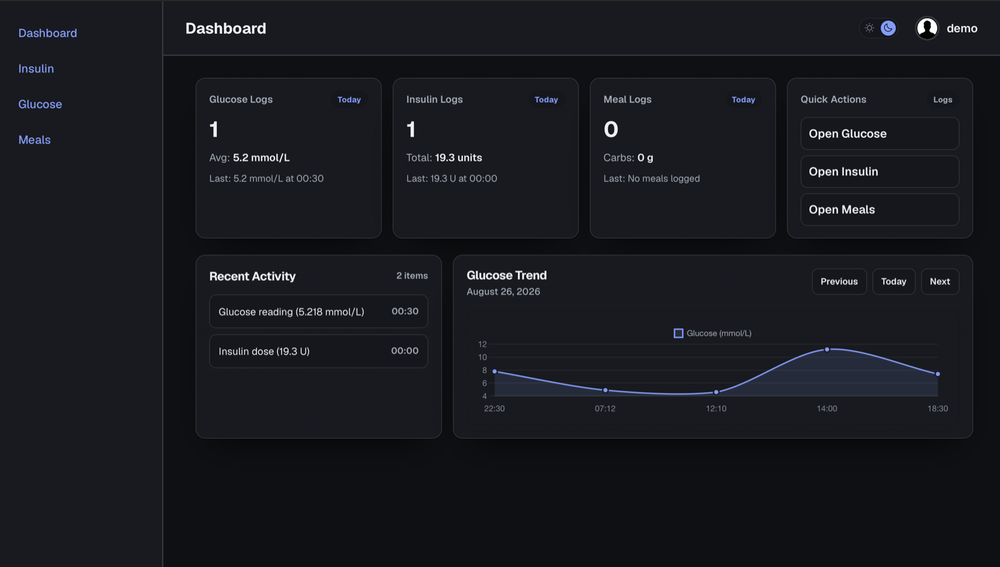
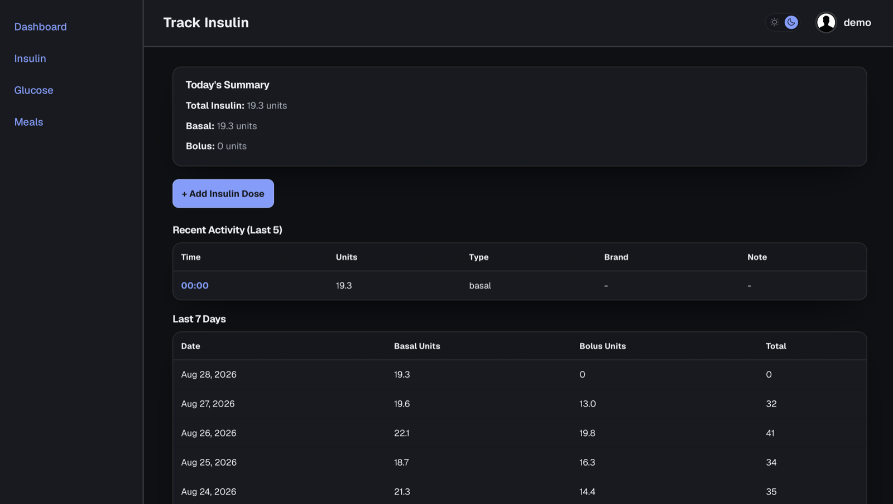
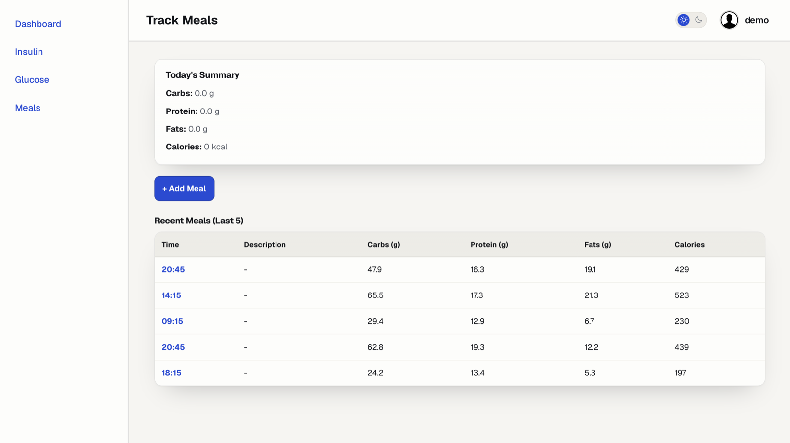
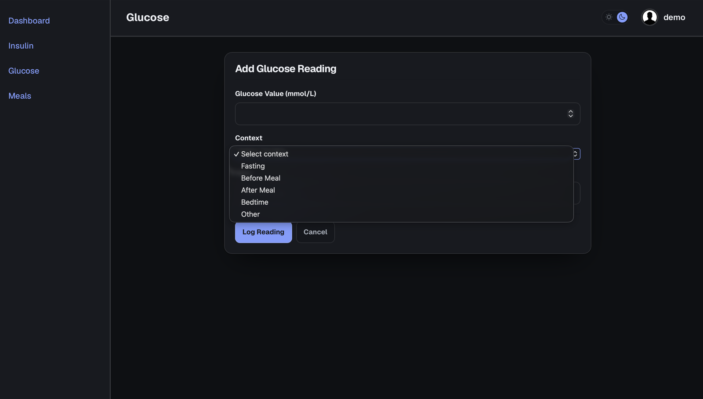
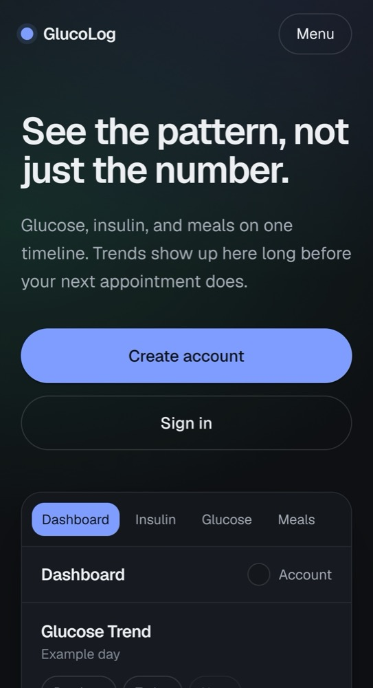
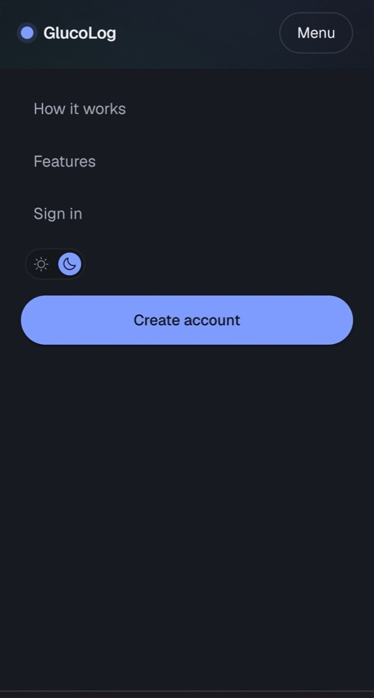
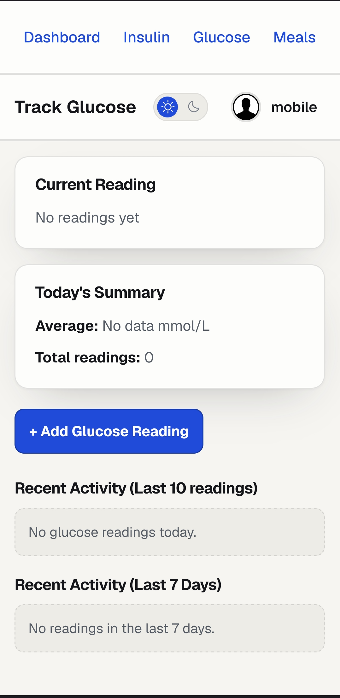

# GlucoRead

A web app for people managing diabetes day-to-day — glucose readings, insulin doses, and
rough meal/macro tracking in one place, with a dashboard that turns raw logs into a picture
of the day.

**Live:** [glucoread.com](https://glucoread.com)
&nbsp;·&nbsp;
[](https://github.com/vedranchi/glucoread/actions/workflows/ci.yml)



---

## The app

The dashboard is the first thing you see after logging in: today's totals, recent activity,
and a glucose trend you can page through day by day.



Every screen ships in both themes, driven by one shared token layer rather than two
hand-maintained stylesheets.

| Insulin — dark | Meals — light |
|---|---|
|  |  |

Logging is made simple: short forms, explicit units, no hidden defaults.



The same templates collapse to a phone without a separate mobile codebase — the layout
stacks to a single column and the nav folds into a full-screen drawer.

| Phone layout | Nav drawer open | Glucose log on mobile |
|---|---|---|
|  |  |  |

## Why this exists

Most CRUD portfolio projects stop at "users can create/read/update/delete a record."
GlucoRead is built around the constraints that make a *health* app different from a todo
app: values have a canonical unit that must never drift, records can never be truly
deleted, every query has to be scoped to the right person, and nothing that touches a
diagnosis belongs in a log line. Those rules are documented and enforced consistently
across the codebase rather than bolted on per-view — see [Engineering notes](#engineering-notes)
below.

It's also a real deployment, not a `localhost` demo: it runs in production on an Oracle
Cloud free-tier VM behind Caddy with a Let's Encrypt certificate, deploys automatically
on merge, and backs up its own database off-site.

## Features

- **Email-based auth** — signup, login, password reset, no username field.
- **Glucose, insulin, and meal logging** — add/edit/delete with per-user history.
- **Dashboard** — daily/weekly summaries and a glucose trend chart.
- **Unit preference** — mmol/L or mg/dL display, per user, without touching stored data.
- **Soft deletes** — logs are archived, never destroyed, so history is always recoverable.
- **Responsive UI** — shared light/dark theme, full-screen mobile nav.

## Engineering notes

A few decisions worth pointing out to anyone skimming the code:

- **Canonical units.** Glucose is always stored in mmol/L. Conversion to/from mg/dL
  happens only at the display/input edge, driven by a per-user preference — so unit
  choice can never corrupt stored data.
- **Soft deletes, enforced by hand.** `GlucoseLog`, `InsulinLog`, and `MealLog` use an
  `is_deleted` flag instead of hard deletes, and every read path filters it explicitly.
  Medical history doesn't get destroyed by a misclick.
- **Per-user isolation, tested.** Every query is scoped with `user=request.user` /
  `get_object_or_404(..., user=request.user)`, backed by a dedicated cross-user
  isolation test suite so one account can never read or edit another's data.
- **PHI hygiene.** Glucose values and user identity are kept out of logs, model
  `__str__` output, and anything that would reach a third-party error reporter.
- **Hardened auth endpoints.** Rate limiting on login/signup/password-reset via
  `django-ratelimit`, `SECURE_*` settings driven entirely by environment variables
  (nothing hard-coded per environment).
- **Real backup/restore, not just a cron job.** Verified Postgres backups run on the VM
  and are pushed off-site to Backblaze B2 automatically — with a documented restore
  drill, not just "the job ran and nobody checked."
- **CI parity with production.** GitHub Actions runs the full test suite with
  `DEBUG=False` against a real Postgres service container — the same failure mode
  (WhiteNoise's manifest storage) that a lazy `DEBUG=True` test run would hide.

## Tech stack

| Layer | Choice |
|---|---|
| Backend | Python, Django 5.2 |
| Database | PostgreSQL 17 |
| Frontend | Server-rendered Django templates, Bootstrap, crispy-forms — no client-side framework |
| Static files | WhiteNoise |
| Email | Env-driven SMTP (Gmail in prod, console backend in dev) |
| Deployment | Docker, gunicorn, Caddy (reverse proxy + automatic TLS) |
| Hosting | Oracle Cloud Always Free VM |
| CI/CD | GitHub Actions → GHCR image → systemd timer pulls on the VM |
| Backups | Nightly Postgres dumps, verified and synced off-site to Backblaze B2 |

## Architecture

| App | Responsibility |
|---|---|
| `users` | Custom email-login `User`, `UserPreferences` (unit system), `HealthProfile`, auth, profile editing |
| `logs` | Core domain: `GlucoseLog`, `InsulinLog`, `MealLog` and their CRUD views |
| `dashboard` | Post-login summary screen and glucose chart |
| `main` | Shared base template, home routing, no-cache middleware |
| `landing` | Public marketing page for anonymous visitors |
| `core` | Settings, URLs, WSGI |

## Running locally

### Prerequisites

- **Python 3.13 or newer.** Check with `python3 --version`. Django 5.2 itself needs 3.10+,
  but CI and the Docker image both run 3.13.
  > macOS ships Python **3.9** at `/usr/bin/python3`, which is too old. If `python3` points
  > there, installing dependencies fails with a misleading
  > `No matching distribution found for Django==5.2.8` — that's the interpreter, not the
  > network. Install a newer Python (e.g. `brew install python@3.13`) and use it explicitly
  > in step 1.
- **Docker**, for the PostgreSQL container.

### Setup

```bash
git clone https://github.com/vedranchi/glucoread.git
cd glucoread

# 1. Virtualenv. Every later command uses ./env/bin/python, so create this first —
#    the secret key in step 2 is generated with Django, which lives in here.
python3 -m venv env
./env/bin/pip install -r requirements.txt

# 2. Config. SECRET_KEY and DATABASE_URL fail fast with no fallback, so this is
#    not optional. The defaults in .env.example match the db container below.
cp .env.example .env

#    Generate a key and paste it into SECRET_KEY. The sed pipe doubles any `$`
#    to `$$` — see the note below for why that matters.
./env/bin/python -c "from django.core.management.utils import get_random_secret_key as k; print(k())" | sed 's/\$/\$\$/g'

# 3. Postgres, on port 5433
docker compose up -d db

# 4. Migrate and run
./env/bin/python manage.py migrate
./env/bin/python manage.py runserver
```

The app is then at **http://127.0.0.1:8000**.

> **Why the `$` escaping:** Docker Compose interpolates `.env`, so a literal `$` starts a
> variable reference and everything after it is silently dropped — Compose warns
> `The "..." variable is not set` and the key it uses differs from the one in the file.
> Django's key generator uses an alphabet that includes `$`, so roughly two thirds of
> generated keys are affected. Doubling each `$` to `$$` avoids it.

### Demo data

Clicking in a fortnight of readings by hand is no way to see the dashboard work, so
there's a seeder that backdates two weeks of plausible glucose/insulin/meal history —
including a partial day for today, so the "Today" cards aren't empty:

```bash
./env/bin/python manage.py seed_demo_data --reset
```

Then sign in as **`demo@glucoread.app`** / **`Demo1234!`**. The command refuses to run
unless `DEBUG=True`, so it can't be pointed at production by accident.

For the Django admin at `/admin/`, create your own superuser:

```bash
./env/bin/python manage.py createsuperuser
```

## Testing

```bash
docker compose up -d db                              # tests need the database
./env/bin/python manage.py collectstatic --noinput   # required — see below
./env/bin/python manage.py test
```

`collectstatic` is **not optional on a fresh clone.** Django's test runner forces
`DEBUG=False`, which switches WhiteNoise to its manifest storage; without a built manifest
every `` tag raises `Missing staticfiles manifest entry` and around 30 of the
50 tests error out. `staticfiles/` is gitignored, so a working copy that has been run
before passes while a clean checkout does not — run it once and the suite goes green.

CI runs the same suite with `DEBUG=False` on every push and pull request against `dev`.

## Troubleshooting

| Symptom | Cause | Fix |
|---|---|---|
| `No matching distribution found for Django==5.2.8` | The venv was built with Python 3.9 (macOS system Python) | Rebuild it with 3.13+: `rm -rf env && python3.13 -m venv env` |
| `KeyError: 'SECRET_KEY'` | No `.env` file | `cp .env.example .env` and set a key |
| `connection to server at "127.0.0.1", port 5433 failed: Connection refused` | Postgres isn't running | `docker compose up -d db` |
| `Missing staticfiles manifest entry for '...'` | No built manifest | `./env/bin/python manage.py collectstatic --noinput` |
| Compose warns `The "..." variable is not set` | Unescaped `$` in a `.env` value | Double it: `$` → `$$` |
| `python: command not found` | macOS has no bare `python` | Use `python3`, or `./env/bin/python` once the venv exists |

## Deployment

Merging to `dev` ships automatically: GitHub Actions tests the change, builds the image,
and pushes it to GHCR; a systemd timer on the VM pulls and restarts only when the image
digest has changed. See [`deploy/README.md`](deploy/README.md) for the full VM runbook.

## How this was built

A large share of the code here was generated with Claude Code, and it seems more useful to
say so than to leave it implied. What that looks like in practice: the domain rules the
generated code has to work within — glucose stored only in mmol/L, soft deletes filtered at
every call site, per-user scoping on every query, no PHI in logs — are written down in
[`CLAUDE.md`](CLAUDE.md) and enforced by the test suite, so an AI-written change is held to
the same line as a hand-written one. The architecture, the domain constraints, and the
decisions about what ships are not generated.

## Status / known limitations

This is an active learning project as well as a working app, so a few things are
open by design rather than overlooked:

- HSTS is currently set to 7 days while HTTPS stability is proven out; it will move to
  a 1-year max-age once that's confirmed.
- Backups are pulled off-site, but full disaster-recovery drills are ongoing.
- Some legacy Bootstrap 4/5 class mismatches remain from an earlier theme pass.

## License

[MIT](LICENSE) © Vedran Chichov

GlucoRead is a personal project for tracking your own readings. It is not a medical device,
it gives no clinical advice, and nothing it displays should be used to make treatment
decisions — talk to your care team instead.
